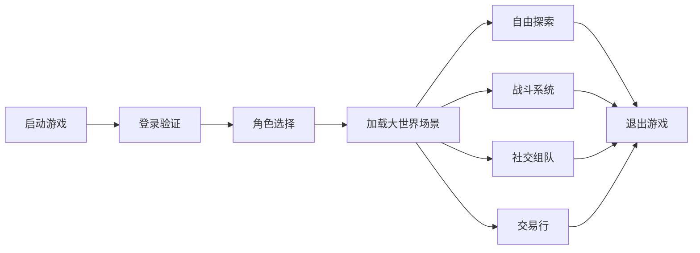
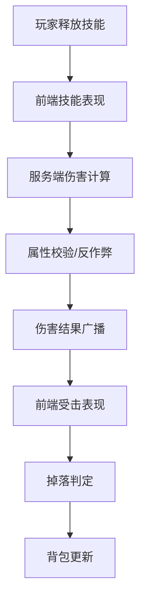

# 大世界开放探索H5游戏 产品需求文档

## 1. 产品概述

本产品是一款基于Web技术的大型多人在线开放世界探索游戏，玩家可在超大无缝地图中自由探索、战斗、组队、交易，体验丰富的生活职业与大世界BOSS玩法。

- **核心目标**：打造移动端浏览器即可畅玩的重度MMO游戏，突破H5性能瓶颈
- **目标用户**：喜欢开放世界探索、社交互动、深度养成的手游/端游玩家
- **市场价值**：填补H5重度MMO空白，实现"即点即玩"的高品质游戏体验

## 2. 核心功能

### 2.1 用户角色

| 角色 | 注册方式 | 核心权限 |
|------|---------|---------|
| 普通玩家 | 手机号/游客登录 | 游戏体验、交易、组队、社交 |
| 运营管理员 | 后台账号登录 | 活动配置、数据监控、风控管理 |

### 2.2 功能模块

1. **大世界探索**：无缝大地图、分块加载、昼夜天气、采集挖矿
2. **战斗系统**：职业技能、连招释放、怪物AI、大世界BOSS
3. **多人互动**：实时同屏、组队副本、跨服战场、聊天系统
4. **经济系统**：自由交易行、背包仓库、绑定/非绑定货币
5. **生活职业**：锻造、炼金、烹饪、裁缝、采集
6. **角色养成**：等级装备、技能天赋、宠物坐骑
7. **活动系统**：限时活动、节日玩法、跨服排行榜

### 2.3 页面详情

| 页面名称 | 模块名称 | 功能描述 |
|---------|---------|----------|
| 登录注册页 | 登录模块 | 手机号登录、游客登录、账号创建 |
| 角色选择页 | 角色创建 | 职业选择、形象定制、角色列表 |
| 游戏主场景 | 3D大世界 | 自由探索、战斗、交互、多人同屏 |
| 角色面板 | 角色信息 | 属性、装备、技能、天赋 |
| 背包系统 | 物品管理 | 背包格子、物品使用、装备穿戴 |
| 交易行 | 自由交易 | 上架物品、购买、搜索、我的摊位 |
| 组队系统 | 社交互动 | 创建队伍、加入队伍、跨服匹配 |
| 活动中心 | 玩法入口 | 限时活动、副本、BOSS、排行榜 |
| 生活技能 | 采集制作 | 采集、锻造、炼金、烹饪 |
| 运营后台 | 管理系统 | 活动配置、数据监控、风控管理 |

## 3. 核心流程

### 3.1 游戏主流程

玩家启动游戏 → 登录验证 → 角色选择 → 加载大世界 → 自由探索/战斗/社交 → 退出保存

### 3.2 战斗与技能流程

## 4. 用户界面设计

### 4.1 设计风格

- **整体风格**：魔幻史诗风格，深色主题配合金色点缀，营造沉浸式游戏氛围
- **主色调**：深紫蓝 `#1a1a2e` 背景，金色 `#d4af37` 强调色，血红 `#e63946` 战斗色
- **按钮风格**：金属质感边框，渐变填充，悬停发光效果
- **字体**：标题使用 Cinzel 装饰性字体，正文使用 Noto Sans SC 清晰易读
- **布局风格**：游戏场景居中，UI控件贴边布局，半透明毛玻璃效果
- **图标风格**：金属边框图标，高光质感，技能图标带冷却遮罩

### 4.2 页面设计概述

| 页面名称 | 模块名称 | UI元素 |
|---------|---------|-------|
| 登录注册页 | 登录模块 | 魔幻背景图、发光输入框、金属质感按钮、粒子动效 |
| 游戏主场景 | 3D大世界 | 顶栏资源条、左侧功能菜单、右侧快捷技能栏、底部聊天框、小地图 |
| 角色面板 | 角色信息 | 3D角色预览、属性列表、装备槽位、技能树 |
| 背包系统 | 物品管理 | 网格背包、物品悬浮提示、装备对比、批量操作 |
| 交易行 | 自由交易 | 搜索筛选、物品列表、上架表单、交易记录 |
| 运营后台 | 管理系统 | 数据仪表盘、配置表单、监控图表、风控列表 |

### 4.3 响应性

- **桌面端优先**：游戏主场景适配1920x1080及以上分辨率
- **移动端适配**：UI控件自适应缩放，触摸操作优化，虚拟摇杆
- **性能分级**：根据设备性能自动调节画质（高/中/低三档）

### 4.4 3D场景指导

- **环境氛围**：魔幻大陆风格，昼夜交替，天气系统（雨/雪/雾）
- **光照设置**：主光源模拟太阳光，环境光补光，体积光效果
- **相机设置**：第三人称跟随视角，可旋转缩放，战斗时自动拉近
- **构图元素**：远景山脉、中景建筑树林、近景玩家角色，层次感分明
- **交互动画**：角色 idle/walk/run/attack 动画，技能粒子特效
- **后期效果**：Bloom泛光、景深、运动模糊、色调映射
- **性能预算**：同屏50+角色，60fps目标，Draw Call控制在200以内

## 5. 核心玩法深度设计

### 5.1 大世界探索

- **无缝地图**：2048x2048格子的超大世界，分块动态加载
- **探索玩法**：隐藏宝箱、随机事件、世界任务、传送点解锁
- **生活资源**：矿石、草药、木材、鱼类分布在不同区域

### 5.2 职业体系

- **战士**：近战物理，高生命高防御，群攻能力
- **法师**：远程魔法，高伤害，控制技能
- **射手**：远程物理，高暴击，机动性强
- **牧师**：辅助治疗，增益BUFF，复活能力

### 5.3 多人互动

- **组队系统**：最多5人组队，共享经验掉落
- **跨服副本**：跨服匹配，挑战高难度BOSS
- **世界BOSS**：全服玩家共同挑战，按伤害排名奖励
- **公会系统**：公会建设、公会战、公会技能

### 5.4 经济系统

- **双货币体系**：绑定金币（系统产出）+ 钻石（充值/稀有产出）
- **自由交易**：玩家间可交易非绑定物品，收取手续费
- **拍卖行**：全服流通，搜索竞价，定时结算
- **风控机制**：异常交易监控，大额交易审核，工作室识别

## 6. 运营与活动

### 6.1 活动类型

- **日常活动**：每日签到、在线奖励、限时任务
- **周常活动**：周副本、周末双倍、公会战
- **节日活动**：限时玩法、节日套装、特殊掉落
- **跨服活动**：跨服竞技场、跨服BOSS、全服排行榜

### 6.2 数据指标

- **核心指标**：DAU、留存率、付费率、ARPU、在线时长
- **游戏指标**：人均探索区域、BOSS参与率、交易活跃度
- **风控指标**：异常账号数、刷金检测数、交易拦截数
