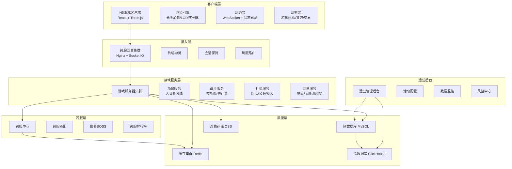
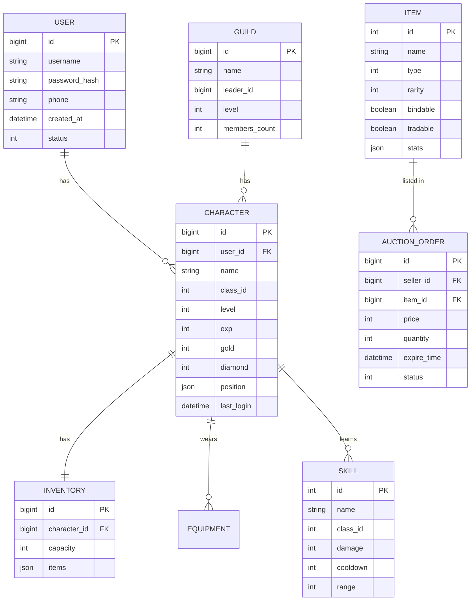
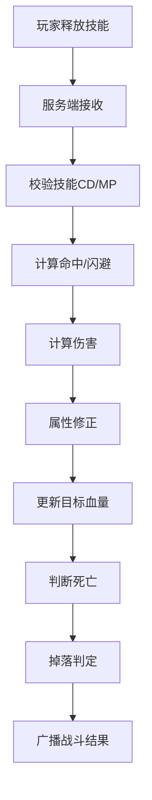
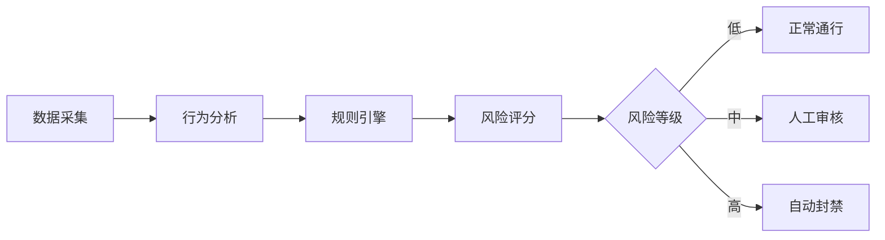
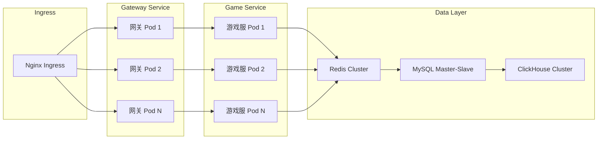

# 大世界开放探索H5游戏 技术架构文档

## 1. 架构总览



## 2. 技术栈说明

### 2.1 前端技术

| 分类 | 技术选型 | 说明 |
|-----|---------|-----|
| 框架 | React 18 + TypeScript | 组件化开发，类型安全 |
| 构建 | Vite 5 | 快速开发构建，HMR热更新 |
| 3D渲染 | Three.js + @react-three/fiber | WebGL渲染引擎 |
| 状态管理 | Zustand | 轻量游戏状态管理 |
| UI样式 | TailwindCSS 3 | 快速UI开发 |
| 网络 | Socket.IO Client | WebSocket实时通信 |
| 动画 | Framer Motion | UI动画过渡 |
| 性能 | InstancedMesh + LOD | 大规模渲染优化 |

### 2.2 后端技术

| 分类 | 技术选型 | 说明 |
|-----|---------|-----|
| 服务端 | Node.js + TypeScript | 游戏逻辑服务 |
| 实时通信 | Socket.IO | WebSocket长连接 |
| 缓存 | Redis 7 | 玩家数据/会话缓存 |
| 数据库 | MySQL 8 | 热数据持久化 |
| 大数据 | ClickHouse | 冷数据/日志分析 |
| 队列 | BullMQ + Redis | 异步任务处理 |
| 网关 | Nginx | 反向代理/负载均衡 |
| 监控 | Prometheus + Grafana | 服务监控告警 |

### 2.3 部署架构

- **容器化**：Docker + Kubernetes
- **CI/CD**：GitHub Actions / Jenkins
- **日志收集**：ELK Stack
- **链路追踪**：Jaeger

## 3. 前端架构

### 3.1 目录结构

```
client/
├── src/
│   ├── components/          # 通用UI组件
│   │   ├── ui/             # 基础UI组件
│   │   └── game/           # 游戏UI组件
│   ├── game/               # 游戏核心逻辑
│   │   ├── engine/         # 3D渲染引擎
│   │   │   ├── World.ts    # 大世界管理
│   │   │   ├── Chunk.ts    # 地图分块
│   │   │   └── Renderer.ts # 渲染优化
│   │   ├── entities/       # 游戏实体
│   │   │   ├── Player.ts   # 玩家实体
│   │   │   ├── Monster.ts  # 怪物实体
│   │   │   └── NPC.ts      # NPC实体
│   │   ├── systems/        # 游戏系统
│   │   │   ├── Combat.ts   # 战斗系统
│   │   │   ├── Skill.ts    # 技能系统
│   │   │   └── Inventory.ts# 背包系统
│   │   └── network/        # 网络层
│   │       ├── Network.ts  # 网络管理器
│   │       └── Protocol.ts # 协议定义
│   ├── pages/              # 页面组件
│   │   ├── Login/
│   │   ├── Game/
│   │   └── Admin/
│   ├── store/              # 状态管理
│   │   ├── usePlayerStore.ts
│   │   └── useGameStore.ts
│   ├── types/              # 类型定义
│   ├── utils/              # 工具函数
│   └── App.tsx
```

### 3.2 核心模块设计

#### 3.2.1 大世界分块加载系统

```typescript
// 地图分块配置
interface ChunkConfig {
  chunkSize: number;      // 每个分块大小
  viewDistance: number;   // 视距（分块数）
  lodLevels: number;      // LOD层级数
}

// 分块管理器
class ChunkManager {
  chunks: Map<string, Chunk>;
  playerChunkPos: { x: number; z: number };
  
  loadChunksAroundPlayer(): void;     // 加载玩家周围分块
  unloadFarChunks(): void;            // 卸载远距离分块
  updateLODLevels(): void;            // 更新LOD层级
}
```

#### 3.2.2 网络同步系统

```typescript
// 网络状态同步
interface EntityState {
  id: string;
  position: { x: number; y: number; z: number };
  rotation: { x: number; y: number; z: number };
  velocity: { x: number; y: number; z: number };
  animation: string;
  health: number;
}

// 客户端预测与插值
class NetworkInterpolator {
  buffer: EntityState[];      // 状态缓冲
  serverTimeOffset: number;   // 服务器时间偏移
  interpolationDelay: number; // 插值延迟
  
  predict(): void;            // 客户端预测
  interpolate(): EntityState; // 状态插值
}
```

#### 3.2.3 实例化渲染优化

```typescript
// 实例化网格管理
class InstancedMeshManager {
  meshes: Map<string, THREE.InstancedMesh>;
  
  addInstance(type: string, matrix: THREE.Matrix4): void;
  removeInstance(type: string, id: number): void;
  updateInstance(type: string, id: number, matrix: THREE.Matrix4): void;
  batchUpdate(type: string, matrices: THREE.Matrix4[]): void;
}
```

### 3.3 性能优化策略

1. **分块加载**：动态加载/卸载地图块，内存占用可控
2. **LOD技术**：远距离物体降低模型精度
3. **视口裁剪**：只渲染相机视锥内的物体
4. **实例化渲染**：大量重复物体使用InstancedMesh
5. **对象池**：频繁创建销毁的对象使用对象池
6. **资源预加载**：预判玩家移动方向预加载资源

## 4. 后端架构

### 4.1 服务划分

```
server/
├── services/
│   ├── gateway/           # 网关服务
│   │   ├── src/
│   │   │   ├── router.ts      # 消息路由
│   │   │   ├── loadbalancer.ts# 负载均衡
│   │   │   └── session.ts     # 会话管理
│   │   └── package.json
│   ├── game/              # 游戏主服务
│   │   ├── src/
│   │   │   ├── scene/        # 场景服务
│   │   │   ├── combat/       # 战斗服务
│   │   │   ├── entity/       # 实体管理
│   │   │   └── ai/           # 怪物AI
│   │   └── package.json
│   ├── social/            # 社交服务
│   │   ├── src/
│   │   │   ├── team.ts        # 组队系统
│   │   │   ├── guild.ts       # 公会系统
│   │   │   └── chat.ts        # 聊天系统
│   │   └── package.json
│   ├── trade/             # 交易服务
│   │   ├── src/
│   │   │   ├── auction.ts     # 拍卖行
│   │   │   ├── economy.ts     # 经济系统
│   │   │   └── risk.ts        # 风控系统
│   │   └── package.json
│   ├── cross-server/      # 跨服服务
│   │   ├── src/
│   │   │   ├── match.ts       # 跨服匹配
│   │   │   ├── worldboss.ts   # 世界BOSS
│   │   │   └── rank.ts        # 排行榜
│   │   └── package.json
│   └── admin/             # 运营后台
│       ├── src/
│       │   ├── activity.ts    # 活动配置
│       │   ├── monitor.ts     # 数据监控
│       │   └── riskctl.ts     # 风控管理
│       └── package.json
├── shared/                # 共享代码
│   ├── protocol/          # 协议定义
│   ├── models/            # 数据模型
│   └── utils/             # 工具函数
└── docker-compose.yml
```

### 4.2 核心数据模型



### 4.3 网络协议设计

#### 4.3.1 消息格式

```typescript
interface GameMessage<T = any> {
  cmd: string;        // 消息指令
  seq: number;        // 序列号
  data: T;            // 消息数据
  timestamp: number;  // 时间戳
}
```

#### 4.3.2 核心协议

| 指令 | 方向 | 说明 |
|-----|-----|-----|
| `login` | C→S | 登录请求 |
| `login_ack` | S→C | 登录响应 |
| `enter_scene` | C→S | 进入场景 |
| `scene_data` | S→C | 场景数据 |
| `move` | C→S | 移动请求 |
| `entity_move` | S→C | 实体移动广播 |
| `use_skill` | C→S | 释放技能 |
| `skill_effect` | S→C | 技能效果广播 |
| `chat` | C↔S | 聊天消息 |
| `trade_list` | S→C | 交易行列表 |
| `team_invite` | C→S | 组队邀请 |

### 4.4 战斗系统架构



### 4.5 风控系统架构



#### 4.5.1 风控规则

- **异常移动**：移动速度超过阈值、穿墙检测
- **刷金检测**：单位时间金币产出异常、交易模式异常
- **工作室识别**：IP聚集、行为模式相似度、批量注册
- **交易风控**：大额交易审核、倒货检测、价格异常
- **技能作弊**：技能CD异常、伤害数值异常

## 5. 数据库设计

### 5.1 缓存层 Redis

- **玩家数据缓存**：Hash结构，key: `player:{id}`
- **在线玩家列表**：Set结构，key: `online:players`
- **场景实体状态**：Stream结构，key: `scene:{id}:entities`
- **排行榜**：Sorted Set，key: `rank:{type}`
- **会话管理**：String结构，key: `session:{token}`

### 5.2 热数据 MySQL

- 用户表、角色表、背包表、装备表
- 公会表、组队表、好友表
- 交易订单表、物品表
- 活动配置表

### 5.3 冷数据 ClickHouse

- 登录日志、战斗日志
- 交易流水、道具产出消耗日志
- 行为埋点数据
- 运营统计数据

## 6. 路由与页面

| 路由路径 | 页面 | 说明 |
|---------|-----|-----|
| `/` | 首页/登录 | 游戏入口页 |
| `/character` | 角色选择 | 创建/选择角色 |
| `/game` | 游戏主场景 | 大世界探索 |
| `/game/inventory` | 背包面板 | 物品管理 |
| `/game/character` | 角色面板 | 属性装备 |
| `/game/auction` | 交易行 | 自由交易 |
| `/game/team` | 组队面板 | 组队社交 |
| `/game/activities` | 活动中心 | 玩法入口 |
| `/admin` | 运营后台 | 管理系统 |

## 7. 部署架构

### 7.1 Kubernetes 部署



### 7.2 扩容策略

- **水平扩容**：游戏场景服务按分区分线水平扩展
- **自动扩缩容**：基于CPU/内存/在线人数的HPA策略
- **活动预热**：节假日活动前提前扩容
- **流量削峰**：请求队列缓冲，平滑处理峰值流量

## 8. 安全设计

### 8.1 前端安全

- 关键逻辑不放在前端，服务端权威
- 资源文件混淆加密
- 反调试检测
- 敏感输入验证

### 8.2 通信安全

- WSS加密传输
- 消息签名防篡改
- 心跳检测防挂机
- 频率限制防攻击

### 8.3 服务端安全

- 输入参数校验
- SQL注入防护
- 权限分级控制
- 操作日志审计
